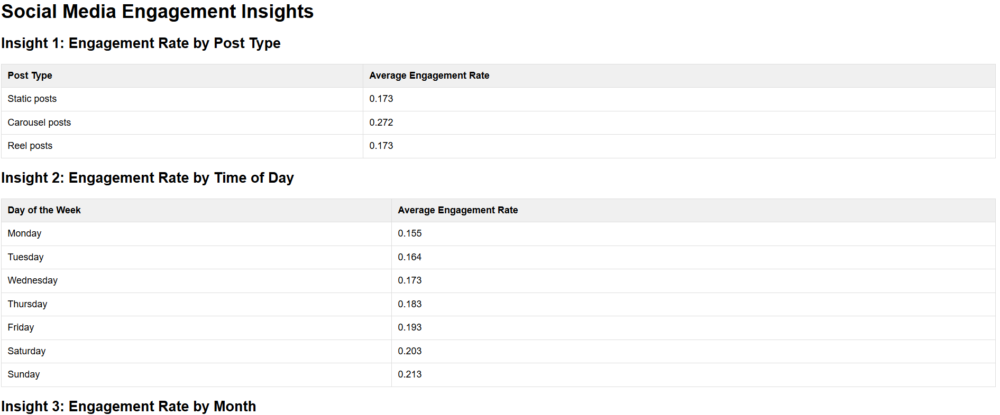

# askMeAboutSM

This project demonstrates a Retrieval Augmented Generation (RAG) pipeline using LangFlow for analyzing social media data.

## Key Features

- **Data-Driven Insights:** Extracts meaningful insights from your social media data, stored in datastax.
- **Personalized Recommendations:** Provides tailored advice on optimal posting times, post type and many more for maximum engagement.
- **Formatted Output:** Generates beautifully formatted HTML outpue with CSS styling.

## Getting Started

1. **Install Dependencies:**
   ```bash
   npm install
   ```
2. **Create an .env file**
   ```javascript
   token=<YOUR_LANGFLOW_APPLICATION_TOKEN>
   ```
3. **Run the project**

   ```bash
      node .\askMeAboutSM.js "message"
   ```

   some example queries you can ask:

   - ```bash
     node .\askMeAboutSM.js "give me some interesting insights related to the social media engagements, How advice me how can I upload post at what time to get most engagement"
     ```

   - ```bash
      node .\askMeAboutSM.js "what is the highest amount of likes on static post"
     ```

4. **Output**
   The generated output will be stores in `output.html` file.

## Example Question you can ask

- "give me some interesting insights related to the social media engagements, How advice me how can I upload post at what time to get most engagement"

- "what is the highest amount of likes on static post"

- "compare the performance of different types of posts (e.g., static, corousel and reel)"

- "Which type of post get most comments"

## Technology used

- **Langflow**: For building and orchestrating the RAG pipeline.
- **Groq AI**: LLM Model used within langflow to create insights from the data and format them.
- **Datastax astra db**: Used it as NO-SQL database to store social media post content.
- **Node js**: Used for running the application.

## Output

Below is the output of this question in html file: **_"give me some interesting insights related to the social media engagements, How advice me how can I upload post at what time to get most engagement"_**


